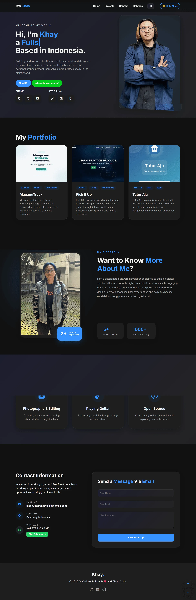

# 🚀 Modern Multi-Language Portfolio | My Portfolio


Selamat datang di repositori portofolio saya! Website ini dirancang untuk menampilkan identitas digital saya sebagai **Software Developer** dengan fokus pada performa, estetika modern, dan pengalaman pengguna yang inklusif.

## ✨ Fitur Utama

-   **🌍 Multi-Language Support**: Perpindahan bahasa instan (English & Indonesia) tanpa reload halaman.
-   **🌓 Dark & Light Mode**: Navigasi yang nyaman di mata dengan sistem deteksi tema yang cerdas.
-   **🖼️ Interactive Project Lightbox**: Galeri detail proyek yang elegan saat gambar diklik.
-   **📱 Fully Responsive**: Tampilan optimal di berbagai perangkat, dari smartphone hingga layar desktop ultra-wide.
-   **✉️ Contact Form Integration**: Terhubung langsung dengan Web3Forms untuk pengiriman pesan ke email.
-   **💬 WhatsApp Quick Action**: Tombol akses cepat untuk komunikasi instan.
-   **⚡ Performance Optimized**: Animasi *scroll-reveal* yang halus dan ringan.
-   **📊 Vercel Web Analytics**: Integrated analytics tracking for visitor insights (auto-enabled when deployed on Vercel).

## 🛠️ Teknologi yang Digunakan

| Tech | Fungsi |
| :--- | :--- |
| **HTML5** | Struktur konten semantik |
| **CSS3** | Custom styling, Glassmorphism, & Flex/Grid |
| **JavaScript (ES6+)** | Logika Multi-language, Theme switcher, & Lightbox |
| **FontAwesome** | Library icon grafis |
| **Google Fonts** | Tipografi premium |

## 🚀 Instalasi Lokal

Ingin mencoba menjalankan proyek ini di komputer kamu?

1. **Clone repositori ini**
   ```bash
   git clone https://github.com/mochamadkhairan/My-Portfolio.git
   ```

2. **Masuk ke direktori**
   ```bash
   cd My-Portfolio
   ```

3. **Buka di Browser**
   Cukup buka file `index.html` menggunakan browser pilihan Anda atau gunakan ekstensi Live Server di VS Code.

## 📊 Enabling Vercel Web Analytics

This project is configured to work with Vercel Web Analytics. To enable analytics tracking:

1. **Deploy to Vercel**: Deploy your site to Vercel (if not already deployed)
2. **Enable Analytics**: 
   - Go to your Vercel dashboard
   - Select your project
   - Navigate to the "Analytics" tab in the sidebar
   - Click the "Enable" button
3. **Deploy**: After enabling, deploy your site (or wait for the next automatic deployment)
4. **Verify**: Check your browser's Network tab for requests to `/_vercel/insights/*` to confirm analytics is working

The analytics scripts are automatically injected by Vercel when deployed - no manual script tags needed!

📸 **Tampilan Website**
[](https://mochamadkhairan.github.io/My-Portfolio/)

🔗 **Live Preview:** [Lihat Website Saya Di Sini](https://mochamadkhairan.github.io/My-Portfolio/)

🤝 Mari Terhubung!
Saya selalu terbuka untuk kolaborasi, diskusi mengenai pengembangan web, atau peluang kerja baru. Jangan ragu untuk menyapa!

LinkedIn: Mochamad Khairan Athallah

Instagram: @m.khairan22

Facebook: Khairan Mochamad

Email: moch.khairanathallah@gmail.com

WhatsApp: +62 878 7263 4316

<p align="center">
Built with ❤️ by <b>Khay</b>
</p>

## 📂 Struktur Proyek

```text
├── aset/               # Gambar proyek, logo, dan foto profil
├── index.html          # File utama (Struktur HTML)
├── style.css           # Styling (Layout, Animasi, Tema)
├── script.js          # Logika (Multi-bahasa, Dark Mode, Lightbox)
└── README.md           # Dokumentasi proyek

